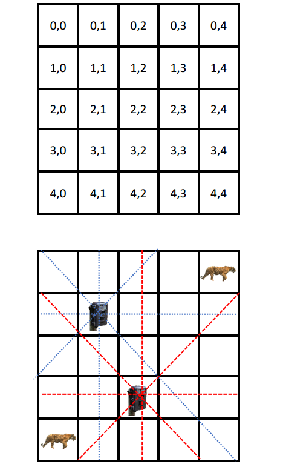

# DFS and A* Search

> This is a course project of USC CSCI 360

The goal of your project is to place the camera traps in locations that do **not conflict** (camera traps cannot be in the same square, same row, same column, or along the same diagonal ) with each other, while **maximizing the total number of animals recorded **(camera and animal in same point) for the day (animals and cameras are all static).  An example of a 5 by 5 grid is given below with each cell’s coordinates: 

* Input:
  * First line: strictly positive 32-bit integer n, the width and height of the n x n park area, n <= 15
  * Second line: strictly positive 32-bit integer c, the number of camera traps, c <= n
  * Third line: strictly positive 32-bit integer a, the number of animals, a <= 100
  * Fourth line: algorithm to use, either astar for A* search or dfs for depth-first search
  * Next a lines: the list of animal x,y coordinates, separated with the End-of-line character LF.

* Output:
  * Max number of images: strictly positive 32-bit integer m 